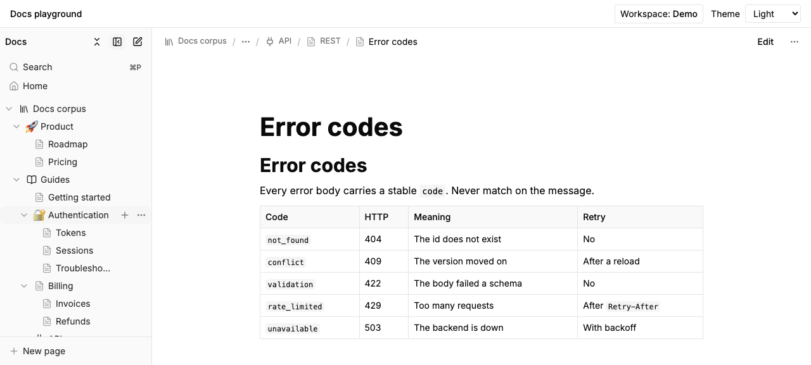
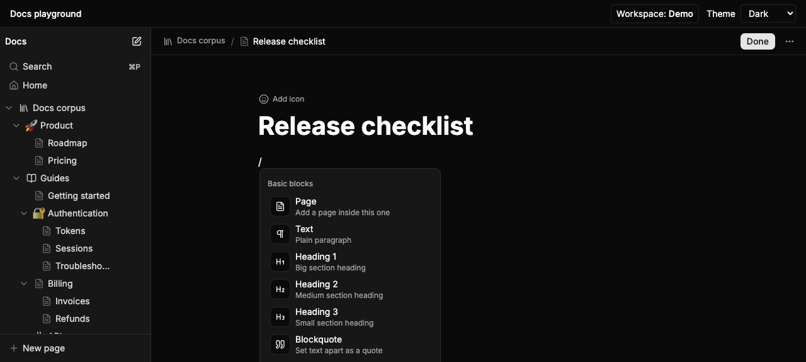
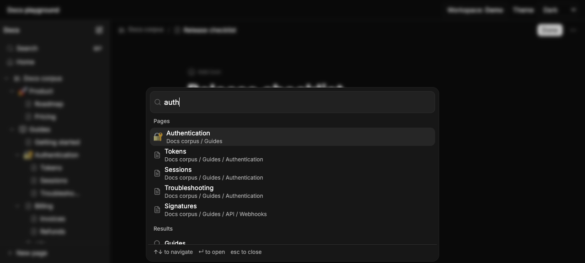

# 📝 notion-style-md-docs-editor

**A Notion-like docs editor for your React app. It reads and writes plain Markdown files.**

[](LICENSE)
[](tsconfig.base.json)
[](#-what-you-need)
[](#-quality)
[](#-speed)

Drop it in and your users get a sidebar tree, a block editor, a search palette, and instant page
loads. Your docs stay as `.md` files in a folder you own.

**No backend needed.** It talks to storage through one small interface. Pick a folder on the
user's computer, the browser's own storage, or your own API.



---

## ✨ What you get

**📂 Navigation**

- A fast sidebar tree. 5,000 pages still scroll at 60 fps.
- Drag pages to move them. Rename in place. Add emoji or Lucide icons.
- `⌘P` opens a palette that searches page names **and** page text.
- Only one branch stays open at a time, so deep folders never flood the sidebar.

**✍️ Editing**

- Type `/` for the block menu. Select text for the floating toolbar.
- Headings, lists, to-dos, tables, code blocks, callouts, toggles, images with captions.
- Text colour and highlight that survive the save.
- `/page` makes a real subpage on disk, just like Notion.

**💾 Saving**

- Autosave with a status you can see. `⌘S` saves right now.
- If someone else edited the file first, you get a conflict card. Nothing is overwritten.
- Drafts live in the browser. Close the tab, come back, your text is still there.
- A warning before an edit would drop Markdown the editor cannot show.

**🧱 Fits your app**

- Five entry points. The editor loads only when someone edits.
- No router, no globals, no page-title takeover, no CSS reset.
- Every word is replaceable (258 strings). Every action fires an event you can listen to.
- All styles live under `.docs-root`. It will not restyle your app.

## 🎬 Try it in one minute

```bash
git clone https://github.com/hmzisb/notion-style-md-docs-editor.git
cd notion-style-md-docs-editor
pnpm i
pnpm dev
```

The playground opens with four ways to load docs:

| Mode | What it does |
|---|---|
| 🎈 **Demo** | A sample set of 33 pages, in memory |
| 📁 **Folder** | A real folder on your computer (Chrome, Edge, Arc) |
| 🌐 **Browser storage** | A private workspace in the browser. Import and export folders |
| ☁️ **Remote** | Any API that follows the HTTP contract |

## 📸 More screenshots

| Block menu (`/`) | Search palette (`⌘P`) |
|---|---|
|  |  |

## 🧩 Add it to your app

> ℹ️ **Not on npm yet.** For now, clone this repo, run `pnpm i && pnpm build`, and point your app
> at `packages/core` and `packages/react`. The package shape is already checked by `publint`,
> `attw`, and two test apps that install the built files.

Once it is on npm:

```bash
pnpm add @docs/react @docs/core @tanstack/react-query platejs
# plus the @platejs/* peers listed in packages/react/package.json
```

Add the styles. If you use Tailwind v4:

```css
/* app.css */
@import "tailwindcss";
@source "../node_modules/@docs/react/dist";
@import "@docs/react/styles.css";
@import "@docs/react/theme.css";   /* skip this if your app already has shadcn variables */
```

No Tailwind? Import `@docs/react/styles.css` on its own. It is already compiled and scoped.

## 🚀 Usage

Two components. `DocsProvider` handles data. `DocsShell` draws the layout.

```tsx
import { DocsProvider, type DocsNavigation } from '@docs/react';
import { DocsShell } from '@docs/react/shell';
import { createFileSystemProvider, pickDirectory } from '@docs/react/adapters/filesystem';
import { useState } from 'react';

// Ask the user for a folder, then read and write Markdown inside it.
const handle = await pickDirectory({ mode: 'readwrite', id: 'my-docs' });
const provider = createFileSystemProvider(handle, { indexCache: true, watch: true });

export function Docs() {
  const [pageId, setPageId] = useState<string | null>(null);
  const [mode, setMode] = useState<'read' | 'edit'>('read');

  const navigation: DocsNavigation = {
    activePageId: pageId,
    mode,
    navigate: (to) => {
      setPageId(to.pageId);
      setMode(to.mode ?? 'read');
    },
  };

  return (
    <DocsProvider provider={provider} navigation={navigation}>
      <DocsShell pageId={pageId} mode={mode} />
    </DocsProvider>
  );
}
```

`navigation` is the only place your router meets the module. Pass your params and your `navigate`.
Add an optional `href()` and the sidebar renders real links.

Ready-made setups for **TanStack Router**, **Laravel + Inertia**, and a **read-only help drawer**
are in [`docs/08-PUBLIC-API.md`](docs/08-PUBLIC-API.md#8-integration-recipes).

Want your own layout instead of the shell? Use `PageTree`, `PageHeader`, `DocumentView`,
`DocumentEditor`, and `useDocumentSession` on their own. The tree knows nothing about routes. The
editor knows nothing about saving.

## 🔌 Where your docs can live

| Adapter | Import from | Stores files in | Good to know |
|---|---|---|---|
| 🧪 Memory | `@docs/react/adapters/memory` | an object you seed | demos and tests; you can fake slow calls and errors |
| 📁 Filesystem | `@docs/react/adapters/filesystem` | a real folder | Chromium browsers only |
| 🌐 OPFS | `@docs/react/adapters/filesystem` | the browser's private storage | works everywhere; import and export folders |
| ☁️ HTTP | `@docs/react/adapters/http` | your API | `GET /tree`, `GET/PUT /pages/:id`, ETags, SSE or polling |

Have your own backend? Write a `DocumentProvider` and run `runProviderConformance()` from
`@docs/core/testing`. It runs 52 checks: trees, conflicts, moves, name clashes, assets, and
permissions.

## 🗂️ How your files become pages

| On disk | In the app |
|---|---|
| `guides/intro.md` | a page |
| `guides/index.md` | the page **for** the `guides` folder; the rest of the folder becomes its children |
| `guides/` with no `index.md` | a folder row: you can open it, but not read it. One click turns it into a page |
| `README.md` | used as `index.md` when there is no `index.md` |
| `.hidden/`, `node_modules/` | skipped |
| anything that is not `.md` | an asset (images and so on) |

**Title** comes from frontmatter `title`, then the first `# heading`, then the file name.
**Order** comes from frontmatter `order`, then the file name.
**IDs** start from the file path. The first time a page is saved, a permanent ID is written into
its frontmatter. To do that for a whole folder at once, run `pnpm doctor <folder> --write-ids`.

## ⌨️ Shortcuts

| Keys | What happens |
|---|---|
| `⌘P` | Open the search palette |
| `⌘\` | Show or hide the sidebar |
| `⌘⇧E` | Switch between reading and editing |
| `⌘⌥N` | New page |
| `⌘S` | Save now |
| `⌘⇧U` | Go to the parent page |
| `F2` · `⌘↑` `⌘↓` | Rename · move a page up or down (sidebar) |
| `/` | Block menu (editor) |
| `⌘⌥1…9` | Turn a block into a heading, list, to-do, code block, or callout |
| `⌘⇧↑` `⌘⇧↓` · `⌘D` | Move a block · copy a block |

The full list, plus drag and drop, is in
[`docs/07-INTERACTIONS-AND-SHORTCUTS.md`](docs/07-INTERACTIONS-AND-SHORTCUTS.md).

## ⚡ Speed

Measured on a production build on one machine (macOS + Chromium). Treat it as a guide, not a promise.

| What | Result | Budget |
|---|---|---|
| Reading UI (`./tree` + `./view`), gzip | **38.9 kB** | 80 kB |
| Full shell, gzip | **96.7 kB** | 98 kB |
| Editor, gzip, loaded on demand | **213.9 kB** | 260 kB |
| Core package, gzip | **33.8 kB** | 40 kB |
| Switch to a cached page | **11.4 ms** | under 100 ms |
| Open a page from browser storage | **20.6 ms** | under 150 ms |
| Scroll a 5,000-page tree | **8.4 ms per frame** | 60 fps |
| Read 5,000 files from disk | **31.7 ms** | under 300 ms |
| Save a page | **79 ms** (95th percentile) | under 300 ms |

## ✅ Quality

```bash
pnpm typecheck     # strict TypeScript across the workspace
pnpm lint          # eslint, including layer rules
pnpm test          # 1,255 unit tests in 60 files
pnpm test:e2e      # 153 Playwright tests: demo, browser storage, WebKit
pnpm build         # build + publint + attw + size checks
pnpm gate all      # everything above, in order
pnpm doctor <dir>  # shows what opening and saving would do to a real folder
```

Also covered: the same conformance suite run against all four adapters, 19 clean accessibility
scans (WCAG 2.1 A/AA), 14 screenshot baselines in two sizes and both themes, and two test apps
that install the built packages — one with Tailwind, one without.

## 🧰 What you need

- React 18.3 or 19, TypeScript 5.9, ESM
- Node 22+ and pnpm 10 to work on this repo
- Tailwind v4 is optional. The CSS ships ready to use either way

## ⚠️ What it cannot do yet

Straight from [`docs/execution/FINAL-REPORT.md`](docs/execution/FINAL-REPORT.md):

1. ⌨️ Typing slows down on very long pages: 33 ms per keystroke at 3,000 blocks (10 ms at 500).
2. 🔍 Search scans files instead of using an index. It stops at 2,000 files or 4 MB per search.
3. 🏷️ Raw HTML inside Markdown is kept as-is, but you cannot edit it as blocks.
4. 📦 The shell bundle is bigger than the original 60 kB target.
5. 🖥️ Speed and screenshot baselines come from one machine. CI does not check them.

## 📚 Documentation

| File | What is inside |
|---|---|
| [`docs/01-PRODUCT-SPEC.md`](docs/01-PRODUCT-SPEC.md) | who it is for, what it does, what it will not do |
| [`docs/02-ARCHITECTURE.md`](docs/02-ARCHITECTURE.md) | packages, layers, boundaries |
| [`docs/03-DATA-MODEL-AND-CONTRACTS.md`](docs/03-DATA-MODEL-AND-CONTRACTS.md) | types, provider interface, file rules, HTTP contract |
| [`docs/04-CACHE-AND-SYNC.md`](docs/04-CACHE-AND-SYNC.md) | cache, drafts, conflicts, offline |
| [`docs/05-EDITOR.md`](docs/05-EDITOR.md) | editor plugins and the Markdown converter |
| [`docs/06-DESIGN-SPEC.md`](docs/06-DESIGN-SPEC.md) | the visual system |
| [`docs/07-INTERACTIONS-AND-SHORTCUTS.md`](docs/07-INTERACTIONS-AND-SHORTCUTS.md) | keyboard, drag and drop, states |
| [`docs/08-PUBLIC-API.md`](docs/08-PUBLIC-API.md) | every export, prop, hook, event, and setup recipe |
| [`docs/10-TESTING-AND-QUALITY.md`](docs/10-TESTING-AND-QUALITY.md) | test plan, budgets, gates |
| [`docs/11-REPO-AND-TOOLING.md`](docs/11-REPO-AND-TOOLING.md) | workspace, build, scripts |

How it was built: [`PROGRESS.md`](PROGRESS.md), [`DEVIATIONS.md`](DEVIATIONS.md),
[`ASSUMPTIONS.md`](ASSUMPTIONS.md), and `docs/execution/`.

## 📦 What is in this repo

```
packages/core     @docs/core   provider interface, Markdown converter, tree and file rules
packages/react    @docs/react  shell, sidebar, reader, editor, adapters, cache
apps/playground   the demo app you get from `pnpm dev`
fixtures          33 sample pages every test runs against
smoke             two apps that install the built packages
contract          generated OpenAPI file for the HTTP contract
```

## 🤝 Contributing

Issues and pull requests are welcome. Before you push:

```bash
pnpm typecheck && pnpm lint && pnpm test
```

CI runs the same four steps plus `pnpm build`. End-to-end, speed, and screenshot tests run
locally with `pnpm gate all`.

## 🙏 Built with

[Plate](https://platejs.org) · [TanStack Query](https://tanstack.com/query) ·
[headless-tree](https://headless-tree.lukasbach.com) · [Radix](https://www.radix-ui.com) ·
[cmdk](https://cmdk.paco.me) · [Tailwind v4](https://tailwindcss.com) · shadcn variables

## 📄 License

[MIT](LICENSE) — free and open source.

Use it, change it, ship it, sell it. Personal or commercial, no permission needed. Just keep the
copyright line in the license file.
